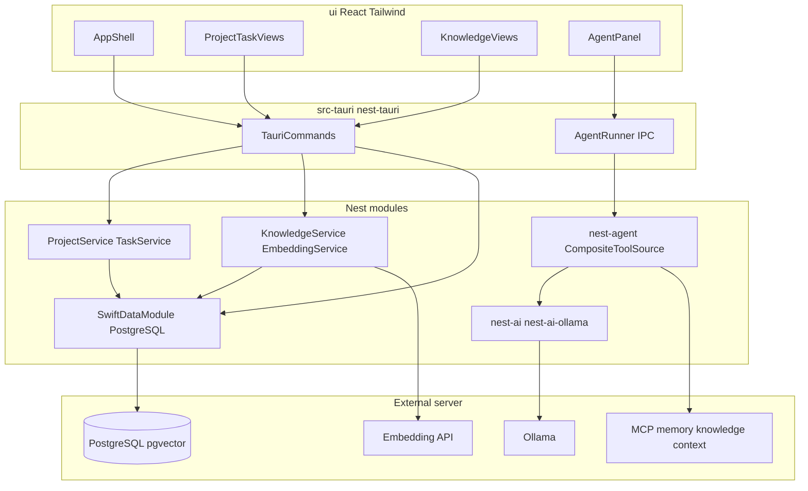

# Swift v1 — master implementation plan

## Status: Planned

See [Swift product docs](../README.md) and [specs](../specs/overview.md).

## Context

**Swift** is a personal desktop app: multi-project task tracking, unified knowledge (notes, emails, Slack, docs), and Ollama AI assistant with **vector search**. It is the **reference product** for the Nest [desktop frontend platform](../../../docs/architecture.md#desktop-frontend-platform) (Tauri + React + Tailwind).

Specs define *what*; sub-plans define *how* for each phase.

## Architecture

```text
ui/ (React)  ──Tauri IPC──►  src-tauri/ (nest-tauri + Swift services)
                                    │
                    ┌───────────────┼───────────────┐
                    ▼               ▼               ▼
              swift-data      nest-agent      nest-ai-ollama
           (PostgreSQL)       + MCP hub       → Ollama
           + pgvector
```



## App location

| Artifact | Path |
|----------|------|
| Source (local) | `apps/swift/` — gitignored, path-patched to nest |
| Specs + plans | `apps/swift/docs/` (specs + plans) |
| Template seed | [`templates/desktop/`](../../../templates/desktop/) |

## Phases

| Phase | Plan | Deliverable |
|-------|------|-------------|
| **0** | [swift-scaffold-v1](./swift-scaffold-v1.md) | Docs (this tree) + app scaffold runs |
| **1** | [swift-data-v1](./swift-data-v1.md) | PostgreSQL schema, pgvector, repositories via `nest-data-postgres` |
| **2** | [swift-pm-v1](./swift-pm-v1.md) | Projects, tasks, kanban/list UI |
| **3** | [swift-knowledge-v1](./swift-knowledge-v1.md) | Knowledge ingest, embeddings, vector search UI |
| **4** | [swift-agent-v1](./swift-agent-v1.md) | Ollama agent + MCP + Swift vector search tools |
| **5** | [swift-template-feedback-v1](./swift-template-feedback-v1.md) | Promote shared UI to desktop template |
| **6** | (this doc) | Tracking views, settings, export polish |

Phase 6 tasks (no separate plan):

- Activity/today/week views per [tracking spec](../specs/tracking.md)
- Settings UI (model, agent policy, database URL)
- Export tasks/knowledge JSON (optional)

## Dependencies

```text
nest-data-postgres-v1 ──► Phase 1 ──► Phase 2 ──► Phase 3
Phase 0 ────────────────────────────────────────────────┘
                              └──► Phase 4 (needs 2+3 for tools)
Phase 2+3 ──► Phase 5
Phase 2+3+4 ──► Phase 6
```

**External:**

- **PostgreSQL 15+ with pgvector** on **remote server** — required from phase 1 (desktop connects over TCP; no local DB)
- **Embedding API** — **Ollama** on server (default); OpenAI optional from phase 3
- **Ollama** on server — required from phase 4 for chat
- `./scripts/index-memory.sh` — for MCP memory tools in agent

## Cross-cutting decisions

| Topic | Decision |
|-------|----------|
| Persistence | **PostgreSQL + pgvector** on **remote server** via **`nest-data-postgres`** |
| Knowledge | Unified `knowledge_items` per project (`note`, `email`, `slack`, `doc`) |
| AI chat + embeddings | **Ollama** on server (`nest-ai-ollama` + `/api/embed`); OpenAI embeddings optional |
| Search | **Vector similarity** (primary) + tsvector keyword (hybrid) |
| Agent writes | Gated by `allow_writes` config |
| UI | Lucide + Tailwind + nest-react-theme |

## Risks

| Risk | Mitigation |
|------|------------|
| `nest-data-postgres` not built yet | [nest-data-postgres v1](../../../docs/plan/nest-data-postgres-v1.md) is phase 1 blocker |
| PostgreSQL unreachable / LAN down | Configurable `[database].url`; health check + clear UI error |
| Tauri system deps on Linux | Document apt packages; CI optional |
| Ollama tool-calling quality | Document tested models; fallback to read-only tools |
| Scope creep (team PM features) | Spec non-goals; personal-first |

## Done when (v1 complete)

1. All phase 0–5 plans marked complete
2. Phase 6 polish items shipped or explicitly deferred with issues
3. `apps/swift/` runs on macOS/Linux with PM + knowledge in PostgreSQL
4. Agent answers questions using MCP + **`swift_search_knowledge`** (vector)
5. At least three UI components promoted to `templates/desktop/`

## Related

- [Swift README](../README.md)
- [Specs index](../README.md#specifications)
- [nest-data-postgres v1](../../../docs/plan/nest-data-postgres-v1.md)
- [nest-tauri v1](../../../docs/plan/nest-tauri-v1.md)
- [nest-agent-mcp v1](../../../docs/plan/nest-agent-mcp-v1.md)
