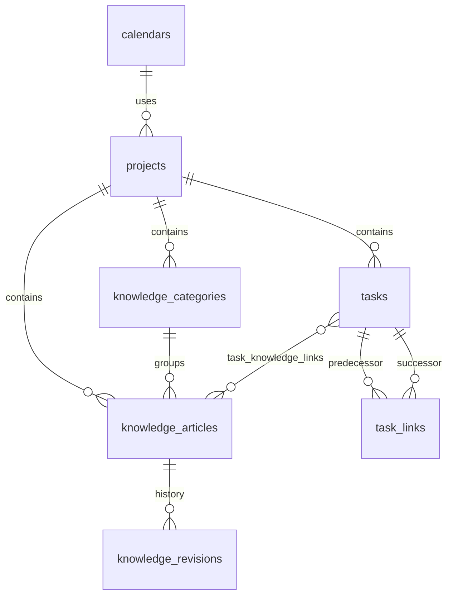

# Swift — database schema (v1)

**Status:** Designed — matches UI mockup (`ui/src/mock/*.ts`)

PostgreSQL 15+ on the remote server (`server.lan`). Migrations live in
`apps/swift/crates/swift-data/migrations/`. Applied via `PostgresMigrationRunner`
(`_nest_migrations` table).

## Mock → table map

| Mock type / file | PostgreSQL tables |
|------------------|-------------------|
| `MockProject` (`demo.ts`) | `projects` + `calendars` |
| `MockTask` (`demo.ts`) | `tasks` + `task_links` |
| `MockKnowledgeCategory` (`knowledgeDemo.ts`) | `knowledge_categories` |
| `MockKnowledgeArticle` (`knowledgeDemo.ts`) | `knowledge_articles` |
| `MockKnowledgeRevision` (`knowledgeDemo.ts`) | `knowledge_revisions` |
| `AppSettings` (`settingsDemo.ts`) | `app_settings` |
| `WorkingTimeView` | `calendars.weekdays_json` |
| `ProjectInfoView` status date / calendar | `projects.status_date`, `projects.calendar_id` |

**Not persisted (UI-only):**

| Mock field | Reason |
|------------|--------|
| `MockTask.bar` | Computed from `start_date` / `finish_date` vs project timeline |
| `MockTask.predecessors` (display string) | Derived from `task_links` rows |
| `collapsedSummaries`, `selectedTaskId`, recents | Client state (`localStorage` OK in v1) |
| Gantt week width, timeline toggle | View prefs in `app_settings.view` |

## Entity relationship

## Tables

### `calendars`

Working-time definition for **Change Working Time** (`WorkingTimeView.tsx`).

| Column | Type | Mock / UI source |
|--------|------|------------------|
| `id` | `UUID` PK | generated |
| `name` | `TEXT` NOT NULL | `"Standard"`, `"Night Shift"`, `"24 Hours"` |
| `week_starts_on` | `SMALLINT` | Settings → Project → week starts on (0=Sun, 1=Mon) |
| `is_24h` | `BOOLEAN` | `24 Hours` calendar preset |
| `hours_per_day` | `INTEGER` | minutes of work per day (default 480 = 8h) |
| `weekdays_json` | `JSONB` | per-day `{ working, hours }` from Working Time grid |
| `created_at` / `updated_at` | `TIMESTAMPTZ` | audit |

Seed row: **Standard** — Mon–Fri 8:00–12:00, 13:00–17:00; Sat/Sun nonworking.

### `projects`

| Column | Type | Mock field |
|--------|------|------------|
| `id` | `UUID` PK | `MockProject.id` |
| `slug` | `TEXT` UNIQUE | `slug` |
| `name` | `TEXT` NOT NULL | `name` |
| `description` | `TEXT` | `description` / Project Info comments |
| `color` | `TEXT` NOT NULL | `color` (hex) |
| `icon` | `TEXT` | optional; not in mock yet |
| `manager` | `TEXT` | `manager` (New Project form) |
| `archived` | `BOOLEAN` | `archived` |
| `pinned` | `BOOLEAN` | `pinned` |
| `percent_complete` | `SMALLINT` 0–100 | `percentComplete` (rollup cache) |
| `start_date` | `DATE` | `startDate` |
| `finish_date` | `DATE` | `finish` (normalized from display) |
| `status_date` | `DATE` | Project Info → Status Date |
| `priority` | `TEXT` | Project Info → Priority |
| `calendar_id` | `UUID` FK → `calendars` | Project Info → Calendar |
| `sort_order` | `INTEGER` | library ordering |
| `created_at` / `updated_at` | `TIMESTAMPTZ` | audit |

Index: `(archived, pinned DESC, sort_order)` for Project Center.

### `tasks`

| Column | Type | Mock field |
|--------|------|------------|
| `id` | `UUID` PK | `MockTask.id` |
| `project_id` | `UUID` FK | `projectId` |
| `parent_id` | `UUID` FK → `tasks` | derived on indent/outdent |
| `outline_level` | `SMALLINT` | `outlineLevel` |
| `is_summary` | `BOOLEAN` | `isSummary` (refreshed on outline change) |
| `is_milestone` | `BOOLEAN` | `isMilestone` |
| `title` | `TEXT` NOT NULL | `name` |
| `notes` | `TEXT` | `notes` (Task form → Notes tab) |
| `duration_days` | `INTEGER` | parsed from `duration` (`"5 days"`) |
| `duration_minutes` | `INTEGER` | working duration for scheduler (optional v1) |
| `start_date` | `DATE` | parsed from `start` display |
| `finish_date` | `DATE` | parsed from `finish` display |
| `percent_complete` | `SMALLINT` 0–100 | `percentComplete` |
| `resource_names` | `TEXT` | `resources` (v1 free text) |
| `priority` | `TEXT` | Advanced → Priority |
| `constraint_type` | `TEXT` | Advanced → Constraint type |
| `constraint_date` | `DATE` | Advanced → Constraint date |
| `deadline` | `DATE` | Advanced → Deadline |
| `effort_driven` | `BOOLEAN` | Advanced → Effort driven |
| `task_type` | `TEXT` | Advanced → Task type |
| `sort_order` | `INTEGER` | row order in grid |
| `actual_start` / `actual_finish` | `DATE` | tracking (Mark on Track) |
| `created_at` / `updated_at` | `TIMESTAMPTZ` | audit |

Index: `(project_id, sort_order)`, `(project_id, start_date)`.

**Display helpers (repository layer, not columns):**

- Predecessors column: format `task_links` as row numbers + link type (`3FS`)
- Duration column: `formatTaskDuration(duration_days, is_milestone)`
- Start/finish column: `formatTaskDate(start_date)`

### `task_links`

Normalized predecessors. Mock stores `"2"`, `"3"` as predecessor row ids; DB stores UUID FKs.

| Column | Type | Notes |
|--------|------|-------|
| `id` | `UUID` PK | |
| `project_id` | `UUID` FK | denormalized for cascade |
| `predecessor_id` | `UUID` FK → `tasks` | |
| `successor_id` | `UUID` FK → `tasks` | |
| `link_type` | `TEXT` | `FS` default; `SS`, `FF`, `SF` later |
| `lag_minutes` | `INTEGER` | default 0 |

Unique: `(predecessor_id, successor_id, link_type)`.

### `knowledge_categories`

| Column | Type | Mock field |
|--------|------|------------|
| `id` | `UUID` PK | `MockKnowledgeCategory.id` |
| `project_id` | `UUID` FK | `projectId` |
| `name` | `TEXT` NOT NULL | `name` |
| `description` | `TEXT` | `description` |
| `sort_order` | `INTEGER` | `sortOrder` |
| `created_at` / `updated_at` | `TIMESTAMPTZ` | audit |

Unique: `(project_id, name)`.

### `knowledge_articles`

Current article head; revisions table stores history.

| Column | Type | Mock field |
|--------|------|------------|
| `id` | `UUID` PK | `MockKnowledgeArticle.id` |
| `project_id` | `UUID` FK | `projectId` |
| `category_id` | `UUID` FK | `categoryId` |
| `title` | `TEXT` NOT NULL | `title` |
| `body` | `TEXT` NOT NULL | `body` (markdown) |
| `source_type` | `TEXT` | `sourceType` — `manual`, `doc`, `email`, `slack`, `url` |
| `source_label` | `TEXT` | `sourceLabel` |
| `source_uri` | `TEXT` | `sourceUri` |
| `embedding` | `vector(768)` | pgvector; null until indexed |
| `search_text` | `tsvector` GENERATED | title + body keyword search |
| `created_at` | `TIMESTAMPTZ` | `createdAt` |
| `updated_at` | `TIMESTAMPTZ` | `updatedAt` |
| `indexed_at` | `TIMESTAMPTZ` | `indexedAt` |

Index: `(project_id, category_id)`, HNSW on `embedding` (cosine).

**Agent `kind` mapping** (not stored — derived):

| `source_type` | Search kind |
|---------------|-------------|
| `manual` | `note` |
| `doc` | `doc` |
| `email` | `email` |
| `slack` | `slack` |
| `url` | `doc` |

### `knowledge_revisions`

Append-only history on every article save.

| Column | Type | Mock field |
|--------|------|------------|
| `id` | `UUID` PK | `MockKnowledgeRevision.id` |
| `article_id` | `UUID` FK | parent article |
| `revision_number` | `INTEGER` | `revisionNumber` |
| `title` | `TEXT` | snapshot |
| `body` | `TEXT` | snapshot |
| `change_note` | `TEXT` | `changeNote` |
| `created_by` | `TEXT` | `createdBy` |
| `created_at` | `TIMESTAMPTZ` | `createdAt` |

Unique: `(article_id, revision_number)`.

### `task_knowledge_links`

Task form notes that reference knowledge articles (future); optional v1.

| Column | Type |
|--------|------|
| `task_id` | `UUID` FK → `tasks` |
| `article_id` | `UUID` FK → `knowledge_articles` |

PK: `(task_id, article_id)`.

### `app_settings`

Persists `AppSettings` from `settingsDemo.ts` (currently `localStorage`).

| Column | Type | Notes |
|--------|------|-------|
| `key` | `TEXT` PK | section id: `file`, `task`, `view`, `project`, `knowledge`, `database`, `agent` |
| `value_json` | `JSONB` | section object |
| `updated_at` | `TIMESTAMPTZ` | |

Configurable lists (`priorities`, `constraintTypes`, `taskTypes`) live in
`app_settings` key `task` → `value_json.priorities` etc.

## Migrations (order)

| File | Contents |
|------|----------|
| `001_extensions.sql` | `pgcrypto`, `vector` |
| `002_calendars.sql` | `calendars` + Standard seed |
| `003_projects.sql` | `projects` |
| `004_tasks.sql` | `tasks`, `task_links` |
| `005_knowledge.sql` | categories, articles, revisions, task_knowledge_links |
| `006_app_settings.sql` | `app_settings` + default rows |

## Vector dimensions

Default **768** (`nomic-embed-text`). Migration `005_knowledge.sql` uses
`vector(768)`. If `app_settings.database.vectorDimensions` is `1536`, run a
dimension migration before re-indexing.

## Deferred (not in mock)

| Feature | Phase |
|---------|-------|
| `labels` / `task_labels` | v1.1 |
| `activity_events` / `timer_sessions` | phase 6 |
| Email/Slack ingest jobs | v1.1 |
| Resource assignment sheet | v1.1 |

## Related

- [data-model](data-model.md) — overview
- [swift-data-v1](../plan/swift-data-v1.md) — implementation plan
- [knowledge](knowledge.md) — search + embeddings
